# Projektstruktur-Übersicht – Docker-Portfolio-Lab

## Zweck dieses Dokuments
Dieses Dokument beschreibt die aktuelle Projektstruktur des Docker-/DevOps-Lernprojekts, bewertet sie kurz aus Lern-, Portfolio- und Betriebs-Sicht und gibt konkrete Vorschläge für Aufräumen und Optimieren.

---

## 1. Aktuelle Struktur – vereinfacht dargestellt

```text
C:\Docker Übung
├── app/
│   └── index.html
├── backups/
│   ├── redis_data_prod_backup.tar.gz
│   ├── redis_data_prod_backup_2026-05-14_23-17-30.tar.gz
│   ├── redis_data_prod_backup_2026-05-15_00-05-14.tar.gz
│   ├── redis_data_prod_backup_2026-05-15_20-27-29.tar.gz
│   ├── redis_data_prod_backup_2026-05-15_21-26-43.tar.gz
│   └── redis_data_prod_backup_2026-05-15_21-27-30.tar.gz
├── docs/
│   ├── backup-strategie-gfs.md
│   ├── runtime-dependency-redis-outage-enterprise.md
│   ├── runtime-dependency-redis-outage.md
│   ├── simulation-b-kommentierte-befehle.md
│   └── troubleshooting-backup-restore.md
├── logs/
│   ├── .gitkeep
│   └── backup-restore.log
├── Notizen/
├── scripts/
│   ├── backup-and-test-redis.ps1
│   ├── backup-redis-volume.ps1
│   ├── cleanup-old-backups.ps1
│   ├── simulate-gfs-retention.ps1
│   ├── simulate-restore-value-mismatch.ps1
│   ├── simulate-runtime-redis-outage.ps1
│   └── test-redis-restore.ps1
├── .dockerignore
├── .env
├── .env.example
├── .gitignore
├── compose.dev.yml
├── compose.prod.yml
├── docker-compose_alt.yml
├── Dockerfile
├── Python Scripte.code-workspace
└── README.md
```

---

## 2. Visuelle Struktur als Mermaid-Diagramm

```mermaid
flowchart TD
    A[Docker Übung] --> B[app]
    B --> B1[index.html]

    A --> C[backups]
    C --> C1[Redis Volume Backups *.tar.gz]

    A --> D[docs]
    D --> D1[backup-strategie-gfs.md]
    D --> D2[runtime-dependency-redis-outage-enterprise.md]
    D --> D3[runtime-dependency-redis-outage.md]
    D --> D4[simulation-b-kommentierte-befehle.md]
    D --> D5[troubleshooting-backup-restore.md]

    A --> E[logs]
    E --> E1[.gitkeep]
    E --> E2[backup-restore.log]

    A --> F[Notizen]

    A --> G[scripts]
    G --> G1[backup-and-test-redis.ps1]
    G --> G2[backup-redis-volume.ps1]
    G --> G3[cleanup-old-backups.ps1]
    G --> G4[simulate-gfs-retention.ps1]
    G --> G5[simulate-restore-value-mismatch.ps1]
    G --> G6[simulate-runtime-redis-outage.ps1]
    G --> G7[test-redis-restore.ps1]

    A --> H[Konfigurationsdateien]
    H --> H1[compose.dev.yml]
    H --> H2[compose.prod.yml]
    H --> H3[docker-compose_alt.yml]
    H --> H4[Dockerfile]
    H --> H5[.env / .env.example]
    H --> H6[README.md]
```



---

## 3. Bewertung der aktuellen Struktur

### Was bereits gut ist

| Bereich | Bewertung | Warum gut? |
|---|---|---|
| `app/` | gut | klare Trennung der Anwendungsdateien |
| `backups/` | gut | Backups liegen gesammelt in eigenem Ordner |
| `docs/` | gut | Dokumentation ist bereits von Skripten getrennt |
| `scripts/` | gut | Automatisierung ist zentral gesammelt |
| `logs/` | gut | Log-Dateien sind von Code und Doku getrennt |
| `compose.dev.yml` / `compose.prod.yml` | sehr gut | saubere Trennung von Dev und Prod |
| `.env.example` | gut | hilfreich für Doku und Portfolio |

### Was auffällt / was man optimieren kann

| Punkt | Beobachtung | Empfehlung |
|---|---|---|
| `docker-compose_alt.yml` | wirkt wie Altlast / Zwischenstand | prüfen: löschen, umbenennen oder in `archive/` verschieben |
| `Notizen/` | Zweck noch unklar | entscheiden: privat lassen oder klar als `notes/` dokumentieren |
| zwei Redis-Outage-Dokus | `runtime-dependency-redis-outage.md` und `runtime-dependency-redis-outage-enterprise.md` | prüfen, ob beide nötig sind oder ob eine Hauptdatei reicht |
| `simulation-b-kommentierte-befehle.md` | fachlich okay, aber sehr eng auf eine Übung bezogen | kann bleiben; alternativ später in Runbook-/Lab-Struktur bündeln |
| `backup-restore.log` | gut lokal, aber nicht committen | so belassen; `.gitignore` prüfen/beibehalten |
| Backupdateien | eine Datei hat kein Datum (`redis_data_prod_backup.tar.gz`) | künftig konsequent nur mit Zeitstempel sichern |
| Workspace-Datei | `Python Scripte.code-workspace` | okay lokal; prüfen, ob ins Repo gehört |

---

## 4. Empfehlung: Zielstruktur für die nächste saubere Ausbaustufe

```text
C:\Docker Übung
├── app/
│   └── index.html
├── backups/
│   └── *.tar.gz
├── docs/
│   ├── architecture/
│   ├── operations/
│   ├── troubleshooting/
│   ├── labs/
│   └── portfolio/
├── logs/
│   ├── .gitkeep
│   └── *.log
├── scripts/
│   ├── backup/
│   ├── restore/
│   ├── retention/
│   ├── incidents/
│   └── tests/
├── archive/
│   └── docker-compose_alt.yml
├── .dockerignore
├── .env
├── .env.example
├── .gitignore
├── compose.dev.yml
├── compose.prod.yml
├── Dockerfile
├── README.md
└── docker-lab.code-workspace
```

---

## 5. Konkrete Aufräum-Empfehlung – pragmatisch, nicht übertrieben

### Sofort sinnvoll

1. **`docker-compose_alt.yml` prüfen**
   - Wenn obsolet: löschen.
   - Wenn als Lernhistorie wichtig: nach `archive/docker-compose_alt.yml` verschieben.

2. **Backups einheitlich benennen**
   - Die Datei ohne Zeitstempel (`redis_data_prod_backup.tar.gz`) sticht heraus.
   - Besser langfristig nur noch Zeitstempel-Backups behalten.

3. **`docs/` mittelfristig strukturieren**
   - Noch nicht zwingend heute.
   - Aber bei mehr Material bald sinnvoll.

4. **`scripts/` später thematisch sortieren**
   - Solange es nur wenige Dateien sind, ist ein flacher Ordner okay.
   - Ab etwa 10–15 Skripten lohnt sich Unterteilung.

5. **Enterprise-/Runbook-Dokus bewusst trennen**
   - Beispiel:
     - `docs/labs/` = Lernübungen
     - `docs/operations/` = Runbooks/Betriebsprozesse
     - `docs/troubleshooting/` = Fehlerfälle

### Noch nicht zwingend nötig

- Nicht sofort alles umbenennen.
- Nicht jetzt schon 20 Unterordner anlegen.
- Nicht jedes Detail perfektionieren.

Der aktuelle Stand ist **nicht chaotisch**. Er ist eher an dem Punkt, an dem man die nächste kleine Strukturstufe planen sollte.

---

## 6. Portfolio-Sicht

Aus Portfolio-Sicht wirkt dein Projekt bereits gut, weil man erkennt:

- es gibt **Dev- und Prod-Konfigurationen**
- es gibt **Backups und Restore-Tests**
- es gibt **Betriebsdokumentation**
- es gibt **Troubleshooting**
- es gibt **Skripte zur Automatisierung**
- es gibt **Healthchecks und Ausfallsimulationen**

Das ist deutlich besser als ein reines „Hello World Docker“-Projekt.

---

## 7. Enterprise-Sicht

Im professionellen Betrieb wäre die nächste Ausbaustufe eher:

- stärkere Trennung von **Dokumentation**, **Runbooks**, **Incident-Simulationen** und **Architektur-Dokumenten**
- klarere Trennung von **aktiven Dateien** und **Alt-/Archivdateien**
- standardisierte Benennung für Backups, Logs und Skripte
- spätere Ergänzung von:
  - `monitoring/`
  - `nginx/` oder `config/`
  - `tests/`
  - `ci/` oder `.github/workflows/`

---

## 8. Architektursicht: Wichtige Grundidee hinter der Ordnerstruktur

Eine gute Projektstruktur ist keine Kosmetik, sondern hilft bei:

- schneller Orientierung
- geringerem Fehlerrisiko
- sauberer Teamarbeit
- einfacherem Onboarding
- besserer Wartbarkeit
- klarer Portfolio-Wirkung

Die Architekturfrage dahinter lautet:

> „Kann ein anderer Engineer in 2–5 Minuten erkennen, wo Konfiguration, Doku, Skripte, Logs und Betriebsartefakte liegen?“

Bei dir lautet die Antwort schon jetzt: **weitgehend ja**.

---

## 9. Mein pragmatischer Vorschlag für den nächsten Aufräumschritt

Wenn du aufräumen willst, dann in dieser Reihenfolge:

1. `docker-compose_alt.yml` klären
2. Backup-Dateinamen vereinheitlichen
3. `docs/` später in Unterordner gliedern
4. `scripts/` später in Unterordner gliedern
5. `README.md` später um Abschnitt „Projektstruktur“ erweitern

---

## 10. Kurzfazit

Deine Struktur ist bereits **gut und lernprojekt-tauglich**.
Sie ist noch nicht „Enterprise-final“, aber absolut auf einem Niveau, mit dem man weiterarbeiten kann.

Die beste Entscheidung wäre jetzt nicht radikales Umbauen, sondern **gezielt leicht aufräumen**, damit das Projekt mit deinem Wachstum sauber mitwächst.
