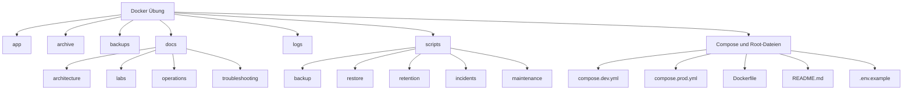

# Projektstruktur und Aufräumrunde im Enterprise-Modus

## Ziel

Diese Aufräumrunde bringt das Docker-/DevOps-Lernprojekt in eine sauberere, portfolio- und betriebsnähere Struktur.

Es geht nicht darum, das Projekt künstlich kompliziert zu machen. Ziel ist:

- schnelleres Finden von Dateien
- klare Trennung von Code, Dokumentation, Logs, Backups und Skripten
- bessere Portfolio-Wirkung
- Vorbereitung auf spätere Kurs-/Trainingsmaterialien
- weniger Risiko, falsche Dateien zu bearbeiten oder zu committen

---

## 1. Job-Szenario

Ein Teamlead oder Senior Engineer sagt:

> „Das Projekt ist technisch gewachsen. Bevor wir weitere Features, Monitoring und CI/CD ergänzen, räumen wir die Struktur auf. Neue Teammitglieder sollen in wenigen Minuten verstehen, wo App-Code, Compose-Dateien, Betriebsdokumentation, Incident-Skripte und Backups liegen.“

Das ist eine reale Arbeitssituation. Projekte wachsen oft erst organisch. Danach kommt der Punkt, an dem Struktur wichtig wird.

---

## 2. Betriebsanforderung

Die neue Struktur soll folgende Anforderungen erfüllen:

| Anforderung | Bedeutung |
|---|---|
| Nachvollziehbare Ordnerstruktur | Andere Engineers finden Dateien schnell |
| Keine aktiven Altdateien im Root | Alte Compose-Dateien sollen nicht mit aktuellen verwechselt werden |
| Backups mit Zeitstempel | Jede Sicherung ist eindeutig identifizierbar |
| Doku nach Zweck sortiert | Betrieb, Labs, Architektur und Troubleshooting sind getrennt |
| Skripte nach Aufgabe sortiert | Backup, Restore, Retention und Incident-Simulationen sind getrennt |
| Keine Löschaktionen ohne Kontrolle | Nichts wird hart entfernt |
| Git-Historie bleibt nachvollziehbar | Verschiebungen werden mit `git mv` durchgeführt, wenn möglich |

---

## 3. Lernziel

Nach dieser Einheit sollst du erklären können:

```text
Eine saubere Projektstruktur ist kein Schönheitsdetail.
Sie reduziert Betriebsrisiko, erleichtert Reviews und hilft beim Onboarding.
```

Wichtige Begriffe:

| Begriff | Erklärung |
|---|---|
| Repository | Git-Projektordner mit versionierten Dateien |
| Root | oberste Ebene des Projektordners |
| `git mv` | Git-Befehl zum Verschieben oder Umbenennen von Dateien |
| `.gitignore` | Datei, die Git sagt, welche lokalen Dateien nicht versioniert werden sollen |
| `.dockerignore` | Datei, die Docker sagt, welche Dateien nicht in den Build-Kontext sollen |
| Build-Kontext | Dateien, die Docker beim Image-Build grundsätzlich sehen kann |
| Archivordner | Ort für alte, nicht aktive Dateien |

---

## 4. Zielstruktur

```text
C:\Docker Übung
├── app/
│   └── index.html
├── archive/
│   └── docker-compose_alt.yml
├── backups/
│   └── redis_data_prod_backup_YYYY-MM-DD_HH-mm-ss.tar.gz
├── docs/
│   ├── architecture/
│   │   └── projektstruktur-und-aufraeumplan.md
│   ├── labs/
│   │   ├── runtime-dependency-redis-outage.md
│   │   ├── runtime-dependency-redis-outage-enterprise.md
│   │   └── simulation-b-kommentierte-befehle.md
│   ├── operations/
│   │   └── backup-strategie-gfs.md
│   └── troubleshooting/
│       └── troubleshooting-backup-restore.md
├── logs/
│   ├── .gitkeep
│   └── backup-restore.log
├── scripts/
│   ├── backup/
│   │   ├── backup-and-test-redis.ps1
│   │   └── backup-redis-volume.ps1
│   ├── incidents/
│   │   ├── simulate-restore-value-mismatch.ps1
│   │   └── simulate-runtime-redis-outage.ps1
│   ├── maintenance/
│   │   └── reorganize-project-structure.ps1
│   ├── restore/
│   │   └── test-redis-restore.ps1
│   └── retention/
│       ├── cleanup-old-backups.ps1
│       └── simulate-gfs-retention.ps1
├── .dockerignore
├── .env
├── .env.example
├── .gitignore
├── compose.dev.yml
├── compose.prod.yml
├── Dockerfile
└── README.md
```

---

## 5. Mermaid-Diagramm



---

## 6. Umsetzung im Lab

Die Umsetzung erfolgt über das Skript:

```text
scripts/maintenance/reorganize-project-structure.ps1
```

Das Skript führt aus:

1. Zielordner erstellen
2. alte Compose-Datei nach `archive/` verschieben
3. Dokumentation nach Themen sortieren
4. Skripte nach Aufgaben sortieren
5. undatiertes Backup umbenennen
6. Pfadverweise in Markdown/README aktualisieren
7. Git-Status anzeigen

---

## 7. Verifikation

Nach der Ausführung muss geprüft werden:

```powershell
# Prüft, ob die Compose-Datei weiterhin gültig ist.
docker compose -f compose.prod.yml config

# Prüft, ob der aktuelle Stack noch läuft.
docker compose -f compose.prod.yml ps

# Zeigt alle Git-Änderungen.
git status

# Zeigt die Änderungssumme.
git diff --stat
```

Erwartung:

- Compose bleibt gültig
- laufende Container bleiben healthy
- Git zeigt Verschiebungen und neue Struktur
- keine unerwarteten Dateien liegen im falschen Ordner

---

## 8. Realistischer Fehlerfall

Mögliche Fehler:

| Fehler | Ursache | Diagnose |
|---|---|---|
| Datei doppelt vorhanden | manuell kopiert statt verschoben | `git status`, VS Code Explorer |
| README-Link kaputt | Pfad nach Verschiebung nicht aktualisiert | Suche nach altem Pfad |
| Skript nicht gefunden | Pfad hat sich geändert | `Get-ChildItem scripts -Recurse` |
| Backup falsch benannt | alte Datei ohne Zeitstempel | `Get-ChildItem backups` |
| Compose kaputt | falsche Datei verschoben | `docker compose -f compose.prod.yml config` |

---

## 9. Diagnoseweg

```powershell
# Zeigt die Struktur rekursiv an.
Get-ChildItem -Recurse -File | Select-Object FullName

# Sucht alte Skriptpfade in Markdown-Dateien.
Select-String -Path .\README.md, .\docs\**\*.md -Pattern "scripts/" -ErrorAction SilentlyContinue

# Sucht alte Dokumentationspfade.
Select-String -Path .\README.md, .\docs\**\*.md -Pattern "docs/" -ErrorAction SilentlyContinue

# Prüft Git-Status.
git status

# Prüft die Compose-Konfiguration.
docker compose -f compose.prod.yml config
```

---

## 10. Fix oder Rollback

Wenn die Aufräumrunde nicht passt:

```powershell
# Zeigt alle Änderungen.
git status

# Macht alle noch nicht committeten Änderungen rückgängig.
git restore .

# Entfernt neue untracked Dateien und Ordner nach vorheriger Vorschau.
git clean -nd

# ACHTUNG: Erst ausführen, wenn die Vorschau korrekt ist.
git clean -fd
```

Wichtig: `git clean -fd` löscht untracked Dateien. Vorher immer `git clean -nd` ausführen.

---

## 11. Dokumentation fürs Portfolio

Portfolio-Formulierung:

> In diesem Projekt wurde die ursprünglich flache Lernprojektstruktur in eine betriebsnähere Struktur überführt. Dokumentation wurde nach Labs, Operations, Troubleshooting und Architektur getrennt. Skripte wurden nach Backup, Restore, Retention, Incident-Simulationen und Maintenance sortiert. Alte Compose-Dateien wurden archiviert, Backup-Dateien vereinheitlicht und Pfadverweise aktualisiert. Ziel war bessere Wartbarkeit, klarere Onboarding-Fähigkeit und eine professionellere Repository-Struktur.

---

## 12. Unterschied Lernlabor vs. Produktion

| Thema | Lernlabor | Produktion |
|---|---|---|
| Ordnerstruktur | pragmatisch und lernfreundlich | standardisiert und teamweit abgestimmt |
| Backups | lokale `.tar.gz`-Dateien | zentrale Backup-Plattform / Object Storage |
| Doku | Markdown im Repo | Runbooks, Wiki, Tickets, ADRs |
| Skripte | PowerShell im Repo | CI/CD, Automation Runner, signierte Skripte |
| Secrets | `.env` lokal | Secret Manager / Vault / Kubernetes Secrets |
| Strukturänderung | direkt im lokalen Repo | Pull Request, Review, Pipeline |

---

## 13. Architect-Notiz

Die größere Architekturentscheidung lautet:

> Wie viel Struktur braucht ein Projekt, ohne es unnötig kompliziert zu machen?

Zu wenig Struktur führt zu Chaos.  
Zu viel Struktur führt zu Overengineering.

Für dieses Projekt ist die neue Struktur sinnvoll, weil:

- das Projekt inzwischen mehrere Betriebsbereiche hat
- Backup, Restore, Retention, Healthchecks und Incident-Simulationen existieren
- später Monitoring, CI/CD, Security und Kubernetes dazukommen
- das Projekt als Portfolio und eventuell als Lernkurs dienen soll

Die Struktur wächst also mit dem Projekt mit.
