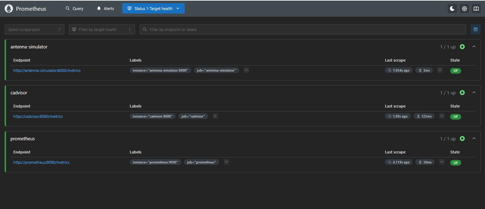
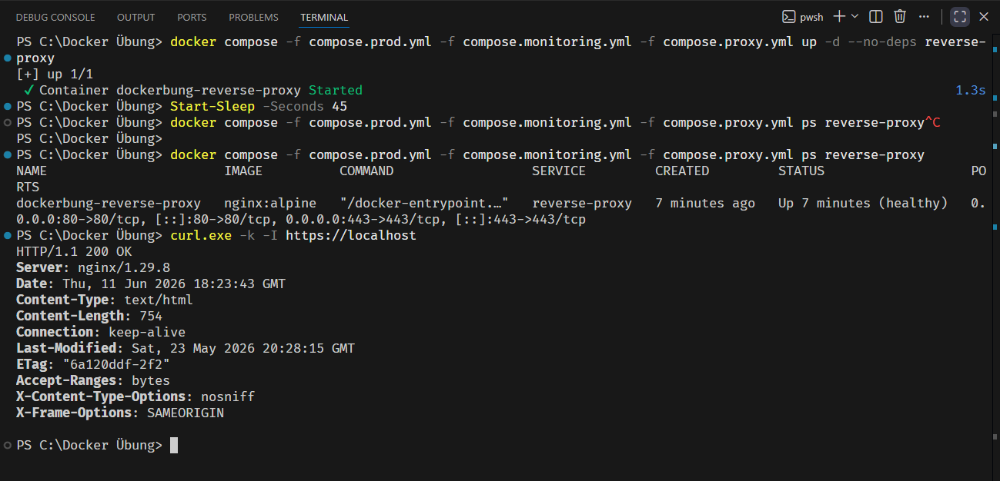
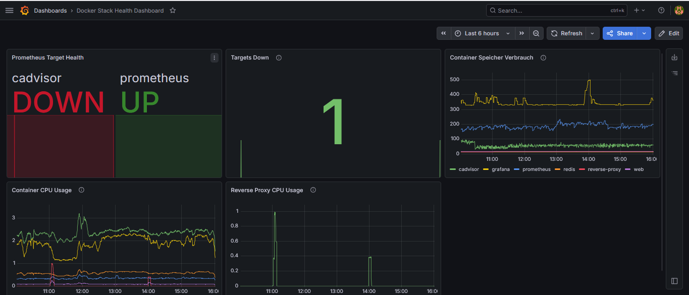
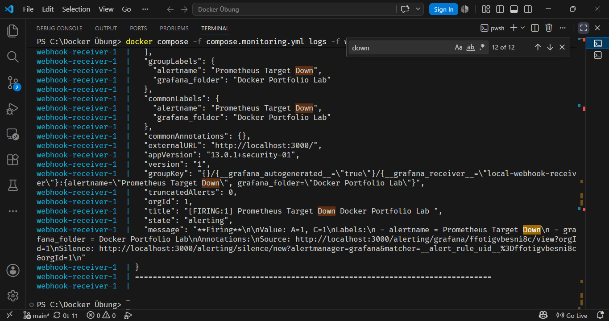
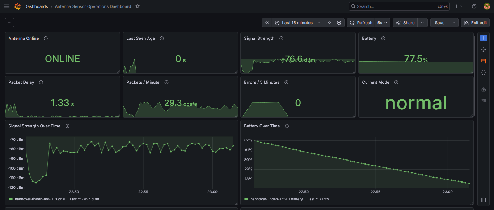
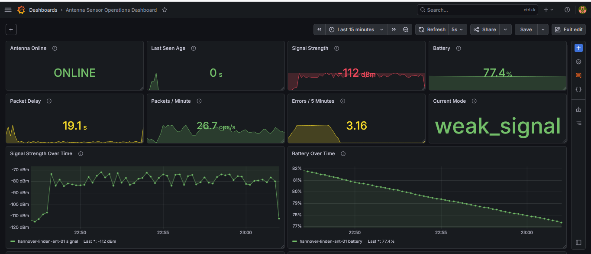
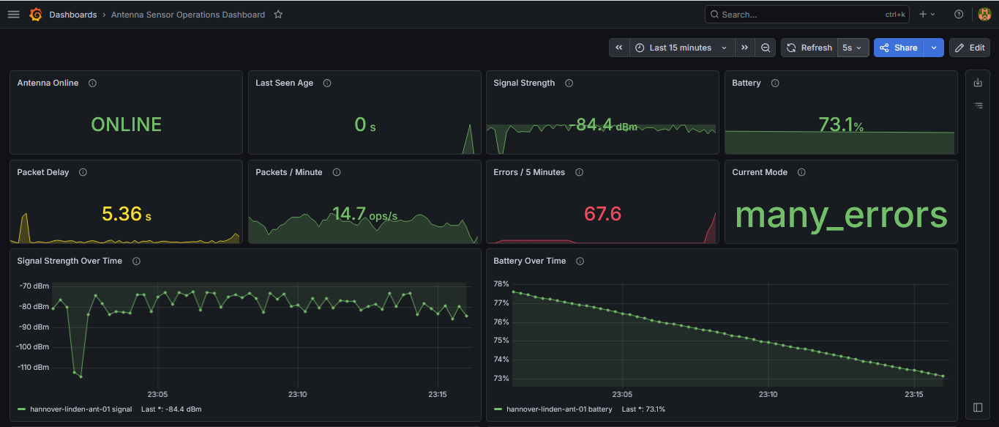
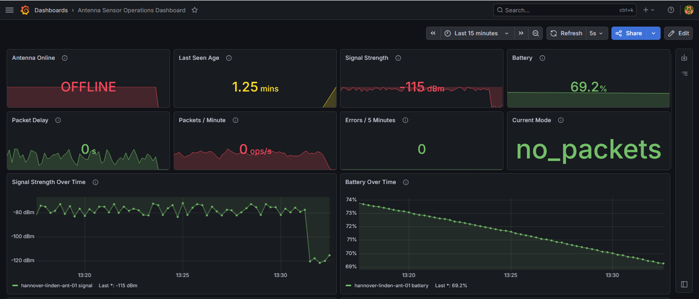
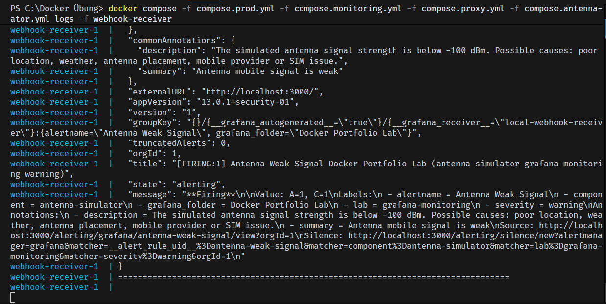
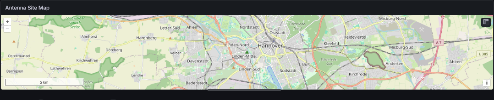

# Grafana Monitoring Lab mit Docker, Prometheus, Alerting und Sensor-Simulation

Dieses Projekt erweitert ein lokales Docker-Monitoring-Lab um eine praxisnahe Observability- und Alerting-Strecke. Ziel war es, nicht nur Container-Metriken sichtbar zu machen, sondern typische Betriebszustände zu simulieren, automatisch zu erkennen und über Grafana-Alerts an einen lokalen Webhook-Receiver zu senden.

Der Stack besteht aus Docker Compose, Prometheus, Grafana, cAdvisor, einem HTTPS-Reverse-Proxy, einem lokalen Webhook-Receiver und einem selbst entwickelten Antennen-/Sensor-Simulator.

## Ziel des Labs

Das Lab zeigt eine vollständige Monitoring-Kette:

```text
Simulator → Prometheus → Grafana Dashboard → Grafana Alert → Contact Point → Webhook Receiver
```

Damit wird nicht nur sichtbar, dass Metriken angezeigt werden. Es wird auch gezeigt, dass ein simulierter Fehler automatisch erkannt, als Alert bewertet und an ein Zielsystem ausgeliefert wird.

## Architekturüberblick

| Komponente | Aufgabe |
|---|---|
| Docker Compose | Startet und verbindet die lokalen Services |
| Prometheus | Sammelt Metriken von cAdvisor, Prometheus selbst und dem Antennen-Simulator |
| Grafana | Visualisiert Metriken, Dashboards und Alerts |
| cAdvisor | Liefert Container-Metriken wie CPU- und Speicherwerte |
| HTTPS-Reverse-Proxy | Stellt den Webdienst über HTTP/HTTPS bereit |
| Webhook-Receiver | Empfängt lokale Grafana-Alert-Benachrichtigungen |
| Antennen-/Sensor-Simulator | Simuliert Betriebszustände einer entfernten Antenne |

## Wichtige Projektdateien

| Datei / Ordner | Zweck |
|---|---|
| `compose.monitoring.yml` | Monitoring-Services wie Prometheus, Grafana und cAdvisor |
| `compose.proxy.yml` | HTTPS-Reverse-Proxy |
| `compose.antenna-simulator.yml` | Antennen-/Sensor-Simulator |
| `monitoring/prometheus/prometheus.yml` | Prometheus-Scrape-Konfiguration |
| `monitoring/antenna-simulator/antenna_simulator.py` | Simulator mit Metriken, Status-Endpunkten und GeoJSON |
| `monitoring/grafana/exports/` | Exportierte Dashboards, Alert Rules und Contact Points |
| `scripts/maintenance/` | Wartungs- und Automatisierungsskripte |

## Prometheus Target Health

Prometheus erreicht die relevanten Targets: `antenna-simulator`, `cadvisor` und `prometheus`.



## HTTPS-Reverse-Proxy mit Healthcheck

Der Reverse Proxy wurde um einen Docker Healthcheck erweitert. Dadurch zeigt Docker nicht nur `Up`, sondern `healthy`. Zusätzlich wurde der HTTPS-Zugriff per `curl.exe -k -I https://localhost` geprüft.



## Simulierter Target-Ausfall im Docker Stack

Für einen realistischen Monitoring-Test wurde cAdvisor absichtlich gestoppt. Das Docker Stack Health Dashboard zeigte daraufhin `cadvisor DOWN`, `prometheus UP` und `Targets Down = 1`.



## Alerting und Webhook-Receiver

Grafana erkannte den Target-Ausfall und löste einen Alert aus. Der Alert wurde über den Contact Point an den lokalen Webhook-Receiver gesendet. Im Terminal war der Payload sichtbar.



## Antennen-/Sensor-Simulator

Der Simulator erzeugt Prometheus-Metriken für einen fiktiven Antennenstandort. Er kann verschiedene Betriebszustände simulieren:

| Modus | Bedeutung |
|---|---|
| `normal` | Normalbetrieb |
| `weak_signal` | Schwaches Mobilfunksignal |
| `many_errors` | Viele Fehler, z. B. Firmware-, API- oder Datenformatproblem |
| `delayed_packets` | Verzögerte Pakete, z. B. schlechte Netzqualität oder Gateway-Überlastung |
| `low_battery` | Niedriger Batteriestand, Wartung nötig |
| `no_packets` | Keine Pakete, mögliche Ursachen: Stromausfall, Netzproblem oder Antennendefekt |

## Normalbetrieb

Im Normalbetrieb ist die Antenne online, die Signalstärke ist stabil, die Paketverzögerung niedrig und der aktuelle Modus ist `normal`.



## Fehlerfall: weak_signal

Im Modus `weak_signal` fällt die Signalstärke deutlich ab. Gleichzeitig steigt die Paketverzögerung. Dieser Zustand kann auf Standort-, Wetter-, Provider-, SIM- oder Antennenprobleme hinweisen.



## Fehlerfall: many_errors

Im Modus `many_errors` steigt die Fehlerrate sichtbar. Dieser Zustand eignet sich zur Simulation von Firmware-, API-, Datenformat- oder Sensorproblemen.



## Fehlerfall: no_packets

Im Modus `no_packets` kommen keine Pakete mehr an. Das Dashboard zeigt die Antenne als `OFFLINE`, der Paketdurchsatz fällt auf `0` und der aktuelle Modus ist `no_packets`.



## Antennen-Alert per Webhook

Zusätzlich zu den Dashboard-Zuständen wurden Grafana-Alert-Regeln für den Simulator erstellt. Eine Antennenstörung wurde automatisch erkannt und an den lokalen Webhook-Receiver gesendet.



## Standortvisualisierung mit GeoJSON

Das Dashboard wurde um eine Geomap erweitert. Der Simulator stellt dafür einen GeoJSON-Endpunkt bereit:

```text
/location.geojson
```

Dieser Endpunkt beschreibt einen ungefähren Demo-Standort der simulierten Antenne. Die Koordinaten sind bewusst nicht als private Adresse zu verstehen, sondern dienen nur als Standortbeispiel.



## Statisches vs. dynamisches GeoJSON

Ein wichtiger Lernpunkt war der Unterschied zwischen statischem und dynamischem GeoJSON.

Statisches GeoJSON beantwortet die Frage:

```text
Wo ist das Objekt?
```

Dynamisches GeoJSON kann zusätzlich aktuelle Betriebsdaten enthalten:

```text
Wie ist der aktuelle Zustand dieses Objekts?
```

Im Lab gibt es deshalb zusätzlich einen dynamischen Status-Endpunkt:

```text
/location-status.geojson
```

Dieser enthält neben dem Standort auch aktuelle Werte wie:

- aktueller Modus
- Online-Status
- Severity
- Signalstärke
- Batteriestand
- Paketverzögerung
- Last-Seen-Age

Die experimentelle Dynamic-GeoJSON-/Alpha-Layer-Idee in Grafana ist ein interessanter technischer Ausblick. Für dieses Portfolio wurde jedoch bewusst zunächst die stabilere Standardvorgehensweise mit einem GeoJSON-Layer verwendet.

## Export und Versionierung

Alle relevanten Konfigurationen wurden exportiert und versioniert:

| Konfiguration | Format |
|---|---|
| Grafana Dashboards | JSON |
| Grafana Alert Rules | YAML |
| Grafana Contact Points | YAML |
| Docker Compose | YAML |
| Prometheus-Konfiguration | YAML |

Der Merksatz aus dem Lernprozess: Im Projekt kamen „Jammel und Jason“ zum Einsatz – gemeint sind YAML und JSON.

## Produktion vs. Lab

Dieses Projekt ist ein lokales Lern- und Portfolio-Lab. In einer produktiven Umgebung wären zusätzliche Schutzmaßnahmen notwendig:

- keine ungeschützten Lab-Control-Endpunkte öffentlich bereitstellen
- Webhooks per HTTPS absichern
- HMAC-Signaturen oder ähnliche Verfahren zur Prüfung von Webhook-Nachrichten nutzen
- Secrets und Tokens niemals in Repositories oder Screenshots veröffentlichen
- Zugriff auf Grafana und Prometheus absichern
- Alerts an reale Systeme wie E-Mail, Slack, Microsoft Teams oder Incident-Management anbinden
- Dashboards, Alert Rules und Contact Points standardisiert provisionieren

## Ergebnis

Das Lab zeigt einen vollständigen Monitoring- und Alerting-Workflow mit Docker, Prometheus und Grafana. Besonders praxisnah ist der Antennen-/Sensor-Simulator, weil typische Betriebsprobleme gezielt ausgelöst und im Dashboard sichtbar gemacht werden können.

Der wichtigste Nachweis ist die vollständige Kette:

```text
Störung simulieren → Metrik ändert sich → Grafana erkennt Zustand → Alert wird ausgelöst → Webhook empfängt Payload
```
