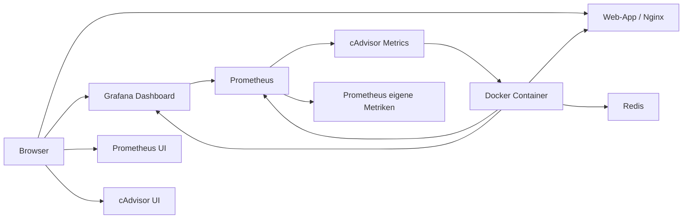

# Monitoring-Grundlagen mit Prometheus und Grafana

## Zweck

Diese Lerneinheit ergänzt das Docker Portfolio Lab um ein kleines, bewusst begrenztes Monitoring-Lab.

Ziel ist nicht, ein vollständiges Enterprise-Observability-System aufzubauen, sondern die Grundidee praktisch zu sehen:

```text
Metriken erfassen → speichern → visualisieren → Betriebszustand besser verstehen
```

---

## 1. Job-Szenario

Ein Teamlead sagt:

> „Der Stack läuft, aber wir wollen nicht nur manuell `docker compose ps` ausführen. Bitte zeig in einem kleinen Lab, wie Monitoring mit Prometheus und Grafana grundsätzlich funktioniert.“

---

## 2. Betriebsanforderung

| Anforderung | Bedeutung |
|---|---|
| Prometheus starten | Metriken sammeln |
| Grafana starten | Metriken visualisieren |
| cAdvisor starten | Container-Metriken bereitstellen |
| Grafana-Passwort als lokales Secret | keine Klartext-Passwörter committen |
| Prometheus-Datenquelle automatisch provisionieren | weniger manuelle Klickarbeit |
| Beispiel-Dashboard automatisch laden | schneller sichtbarer Lernerfolg |
| Lab klar von Production abgrenzen | kein Overengineering vortäuschen |

---

## 3. Begriffe

| Begriff | Erklärung |
|---|---|
| Monitoring | Beobachtung des technischen Zustands eines Systems |
| Metrik | messbarer Zahlenwert, z. B. CPU, Speicher, Requests |
| Logs | textuelle Ereignisse, z. B. Fehlermeldungen |
| Alert | Warnung bei einem problematischen Zustand |
| Prometheus | System zum Sammeln und Speichern von Metriken |
| Scrape | regelmäßiges Abfragen von Metriken |
| Target | Ziel, von dem Prometheus Metriken abfragt |
| Grafana | Oberfläche zum Visualisieren von Metriken |
| Dashboard | Sammlung von Diagrammen und Panels |
| cAdvisor | Tool, das Container-Metriken bereitstellt |
| Exporter | Komponente, die Metriken für Prometheus bereitstellt |

---

## 4. Architektur im Lab

```text
Docker Compose Stack
├── web
├── redis
├── prometheus
│   ├── scrape: prometheus:9090
│   └── scrape: cadvisor:8080
├── cadvisor
│   └── stellt Container-Metriken bereit
└── grafana
    └── zeigt Prometheus-Metriken im Dashboard
```

### Mermaid-Diagramm



Dieses Diagramm zeigt den Datenfluss:

```text
cAdvisor beobachtet Container
Prometheus sammelt Metriken
Grafana fragt Prometheus ab
Browser zeigt Dashboard und UIs
```

---

## 5. Dateien

Neue Dateien:

```text
compose.monitoring.yml
monitoring/prometheus/prometheus.yml
monitoring/grafana/provisioning/datasources/prometheus.yml
monitoring/grafana/provisioning/dashboards/dashboards.yml
monitoring/grafana/dashboards/docker-lab-overview.json
docs/operations/monitoring-prometheus-grafana.md
```

Geänderte Datei:

```text
.dockerignore
```

Grund für `.dockerignore`:

```text
monitoring/ wird nicht für den Web-Image-Build benötigt.
Die Dateien werden zur Laufzeit als Volumes in Prometheus/Grafana gemountet.
```

---

## 6. Lokales Grafana-Secret erstellen

```powershell
# Wechselt in den Projektordner.
cd "C:\Docker Übung"

# Erstellt den lokalen Secrets-Ordner.
# Der Ordner existiert eventuell bereits.
New-Item -ItemType Directory -Force -Path .\secrets

# Erstellt ein lokales Grafana-Admin-Passwort, falls es noch nicht existiert.
# SECURITY: Die Datei wird durch .gitignore geschützt und nicht committed.
if (-not (Test-Path .\secrets\grafana_admin_password.txt)) {
    Set-Content -Path .\secrets\grafana_admin_password.txt -Value "local_grafana_admin_password_please_change" -NoNewline
}

# Prüft, ob Git die echte Secret-Datei ignoriert.
git check-ignore -v secrets/grafana_admin_password.txt
```

---

## 7. Monitoring-Stack starten

```powershell
# Startet den produktionsnahen Stack plus Monitoring-Erweiterung.
docker compose -f compose.prod.yml -f compose.monitoring.yml up -d --build

# Zeigt alle Services.
docker compose -f compose.prod.yml -f compose.monitoring.yml ps
```

---

## 8. Weboberflächen

| Tool | URL | Zweck |
|---|---|---|
| Web-App | http://localhost:8082 | bestehende App |
| Prometheus | http://localhost:9090 | Metriken/Targets prüfen |
| Grafana | http://localhost:3000 | Dashboard ansehen |
| cAdvisor | http://localhost:8085 | Container-Metriken direkt ansehen |

Grafana Login im Lab:

```text
Benutzer: admin
Passwort: local_grafana_admin_password_please_change
```

Security-Hinweis:

```text
Das ist ein lokaler Lab-Wert.
In Produktion niemals so verwenden.
```

---

## 9. Verifikation

```powershell
# Prüft die Compose-Konfiguration.
docker compose -f compose.prod.yml -f compose.monitoring.yml config

# Prüft, ob alle Container laufen.
docker compose -f compose.prod.yml -f compose.monitoring.yml ps

# Prüft Prometheus lokal.
Invoke-WebRequest -Uri http://localhost:9090/-/ready -UseBasicParsing

# Prüft Grafana lokal.
Invoke-WebRequest -Uri http://localhost:3000/api/health -UseBasicParsing

# Prüft cAdvisor-Metriken lokal.
Invoke-WebRequest -Uri http://localhost:8085/metrics -UseBasicParsing
```

In Prometheus prüfen:

```text
Status → Target health
```

Erwartung:

```text
prometheus = UP
cadvisor = UP
```

In Grafana prüfen:

```text
Dashboards → Docker Portfolio Lab Overview
```

Erwartung:

```text
Dashboard öffnet sich
Panels sind sichtbar
Prometheus ist als Datenquelle verbunden
Metriken werden angezeigt
```

---

## 10. Ergebnis im lokalen Lab

Im lokalen Lab wurden folgende Ergebnisse beobachtet:

```text
cAdvisor /metrics       HTTP 200
Prometheus /-/ready     HTTP 200
Grafana /api/health     HTTP 200
Prometheus Target       cadvisor = up
Prometheus Target       prometheus = up
Grafana Dashboard       Docker Portfolio Lab Overview sichtbar
```

Alle relevanten Container liefen im Docker-Compose-Status als `healthy`:

```text
web
redis
prometheus
grafana
cadvisor
```

Der wichtigste fachliche Nachweis:

```text
Prometheus sammelt Metriken von cAdvisor.
Grafana visualisiert diese Metriken im Dashboard.
cAdvisor liefert Container-Metriken aus der lokalen Docker-Desktop-/WSL2-Umgebung.
```

---

## 11. Docker Desktop / Windows / WSL2 Hinweis

Das Lab wurde unter Windows mit Docker Desktop und WSL2 ausgeführt.

Das ist fachlich wichtig, weil cAdvisor stark von Linux-Hostinformationen lebt. Unter Docker Desktop läuft Docker zwar in einer Linux-/WSL2-Schicht, aber diese Umgebung ist nicht identisch mit einem klassischen Linux-Server.

### Beobachtete cAdvisor-Meldungen

In den Logs traten unter anderem folgende Meldungen auf:

```text
Failed to get system UUID
Error while reading product_name
Couldn't collect info from machine-id
Registration of crio container factory failed
Registration of podman container factory failed
Could not configure a source for OOM detection
```

### Einordnung

Diese Meldungen sind in diesem Lab nicht fatal.

Warum?

```text
cAdvisor läuft weiter.
Docker factory wurde erfolgreich registriert.
Der /metrics-Endpunkt liefert HTTP 200.
Prometheus sieht cadvisor als UP.
Grafana zeigt Metriken im Dashboard.
```

### Bedeutung der einzelnen Hinweise

| Logmeldung | Bedeutung |
|---|---|
| `Failed to get system UUID` | cAdvisor findet keine klassische Maschinen-ID |
| `product_name` fehlt | bestimmte Hardware-/DMI-Informationen sind in WSL2 nicht verfügbar |
| `machine-id` fehlt | Host-Identität ist nicht wie auf einem klassischen Linux-System verfügbar |
| `crio.sock` fehlt | CRI-O ist nicht installiert; bei Docker normal |
| `podman.sock` fehlt | Podman ist nicht installiert; bei Docker normal |
| `/dev/kmsg` fehlt | Kernelmeldungen/OOM-Events können nicht vollständig gelesen werden |
| Docker factory successfully | wichtig: Docker-Erkennung funktioniert |
| `/metrics` HTTP 200 | wichtig: Metriken werden bereitgestellt |

### Mögliche Probleme auf Docker Desktop / Windows

Typische Probleme in ähnlichen Setups können sein:

```text
cAdvisor startet nicht
cAdvisor bleibt unhealthy
Prometheus Target cadvisor = down
/metrics liefert keinen HTTP 200
Grafana Dashboard bleibt leer
CPU-/Memory-Metriken fehlen teilweise
Disk-/Filesystem-Metriken sind unvollständig
Host-Pfade wie /sys oder /var/lib/docker sind nicht korrekt verfügbar
OOM-Events können nicht gelesen werden
```

### Fazit für dieses Lab

```text
Das Monitoring-Lab funktioniert in dieser Docker-Desktop-/WSL2-Umgebung ausreichend gut.
Die cAdvisor-Warnungen wurden eingeordnet.
Die Kernfunktion — Container-Metriken für Prometheus und Visualisierung in Grafana — ist nachgewiesen.
```

---

## 12. Realistischer Fehlerfall

### Problem: Grafana startet, aber Dashboard ist leer

Mögliche Ursachen:

```text
Prometheus-Datenquelle nicht geladen
Prometheus kann cAdvisor nicht erreichen
cAdvisor liefert auf Docker Desktop Windows eingeschränkte Daten
zu kurzer Zeitraum im Dashboard
```

### Diagnose

```powershell
docker compose -f compose.prod.yml -f compose.monitoring.yml ps
docker compose -f compose.prod.yml -f compose.monitoring.yml logs --tail=80 prometheus
docker compose -f compose.prod.yml -f compose.monitoring.yml logs --tail=80 grafana
docker compose -f compose.prod.yml -f compose.monitoring.yml logs --tail=80 cadvisor
```

Prometheus UI prüfen:

```text
http://localhost:9090/targets
```

---

## 13. Fix oder Rollback

Monitoring neu starten:

```powershell
docker compose -f compose.prod.yml -f compose.monitoring.yml restart prometheus grafana cadvisor
```

Monitoring stoppen, aber Hauptstack behalten:

```powershell
docker compose -f compose.prod.yml -f compose.monitoring.yml stop prometheus grafana cadvisor
```

Alles stoppen:

```powershell
docker compose -f compose.prod.yml -f compose.monitoring.yml down
```

Volumes entfernen nur bewusst:

```powershell
docker compose -f compose.prod.yml -f compose.monitoring.yml down -v
```

Warnung:

```text
down -v entfernt auch Monitoring- und Redis-Volumes.
Nur nutzen, wenn Datenverlust im Lab akzeptiert ist.
```

---

## 14. Unterschied Lernlabor vs. Produktion

| Thema | Lernlabor | Produktion |
|---|---|---|
| Prometheus | lokaler Container | HA-/Managed Monitoring |
| Grafana | lokaler Container | geschützte Instanz, SSO, Rollen |
| cAdvisor | lokaler Container unter Docker Desktop/WSL2 | Node Exporter, kube-state-metrics, Cloud Metrics, Kubernetes-Monitoring |
| Secrets | lokale Secret-Datei | Vault, Cloud Secret Manager, Kubernetes Secrets |
| Dashboards | einfaches Beispiel | standardisierte Dashboards, Review |
| Alerts | noch nicht enthalten | Alertmanager, On-Call, Eskalation |
| Retention | Docker Volume | definierte Aufbewahrung, Storage-Planung |
| Security | Lab-Login | TLS, Auth, RBAC, Netzwerksegmentierung |
| Host-Metriken | teilweise abhängig von Docker Desktop/WSL2 | klarer auf Linux-Servern oder Managed-Plattformen |

---

## 15. Security-Hinweise

Monitoring kann sensible Informationen sichtbar machen:

```text
Container-Namen
interne Service-Namen
Pfade
Hostnamen
Netzwerkdaten
Nutzungsverhalten
Fehlerzustände
```

Deshalb:

```text
Grafana nicht ungeschützt öffentlich ins Internet stellen.
Screenshots von Dashboards vor Veröffentlichung auf sensible Informationen prüfen.
Keine Secrets in Labels, Logs oder Dashboard-Texten anzeigen.
Admin-Passwörter nicht committen.
Monitoring-Zugriff in Produktion rollenbasiert absichern.
```

---

## 16. Portfolio-Formulierung

> Das Projekt enthält ein kleines Monitoring-Lab mit Prometheus, Grafana und cAdvisor. Prometheus sammelt Metriken, Grafana visualisiert sie über eine automatisch provisionierte Datenquelle und ein Beispiel-Dashboard. Das Lab zeigt die Grundidee von Metriken und Dashboards. In der lokalen Docker-Desktop-/WSL2-Umgebung wurden cAdvisor-Warnungen zu fehlenden Hostinformationen eingeordnet, während die Kernfunktion — Metriken über `/metrics`, Prometheus Targets `UP` und Visualisierung in Grafana — erfolgreich nachgewiesen wurde. Das Projekt grenzt bewusst ab, dass produktionsreifes Monitoring zusätzliche Komponenten wie Authentifizierung, Alerting, Retention, Hochverfügbarkeit und Zugriffsschutz benötigt.

---

## 17. Architect-Notiz

Die größere Architekturfrage lautet:

> Was muss beobachtet werden, damit ein System zuverlässig betrieben werden kann?

Es gibt mehrere Ebenen:

```text
Container läuft
Service ist healthy
Stack ist ready
Metriken zeigen Auslastung
Logs zeigen Ereignisse
Alerts melden Probleme
Dashboards helfen bei Diagnose
```

Diese Übung ergänzt Healthchecks und Readiness um die nächste Ebene: sichtbare Metriken.
